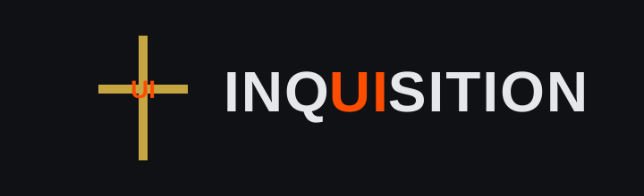

<p align="center">
  
</p>

<h1 align="center">InqUIsition</h1>

<p align="center">
  Mobile-first CSS-in-JS framework forged in discipline.
</p>

<p align="center">
  <b>Purge the unnecessary.</b>
</p>

---

## ⚔ About

**InqUIsition** is a minimal, scalable UI framework built with:

- ⚛ React
- 🧠 TypeScript
- 🎨 Stitches (CSS-in-JS)
- 📱 Mobile-first architecture

Designed for pet projects that demand structure, clarity, and discipline.

No inline chaos. No unnecessary abstractions. No mercy.

---

## 🔥 Philosophy

- Mobile-first
- Strict layout primitives
- Variant-driven components
- Zero overengineering
- Clean separation of core / system / components
- Tree-shake friendly

---

## 📦 Installation

```bash
npm install inq-ui-sition
